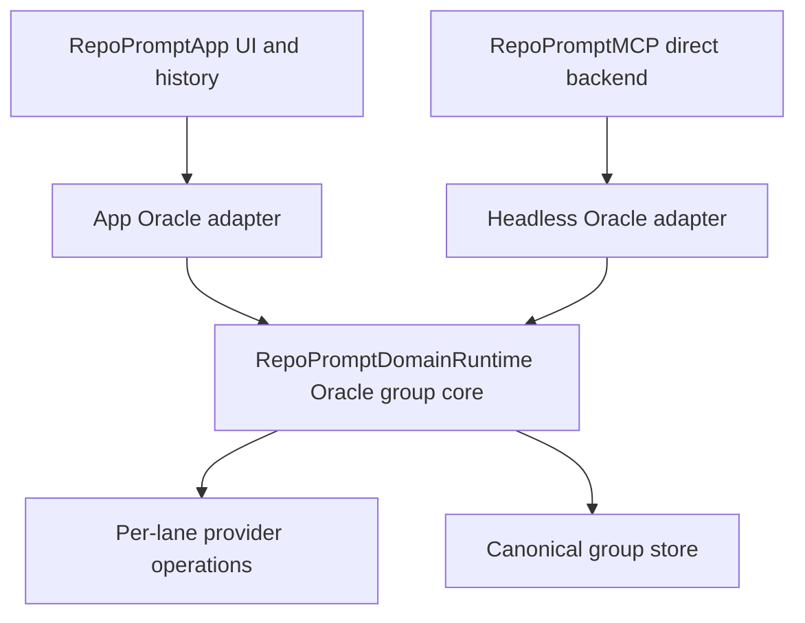

# Oracle groups rewrite: architecture and lessons from PR #782

Status: proposed rewrite architecture; no implementation is included in this document.

Baseline reviewed: upstream `main` at `de7b14adbf659ee83511fb61cbd6de8e041ad359` (2026-08-11), plus the unmerged experiments in [PR #782].

Begin the rewrite from that upstream baseline. Do **not** cherry-pick the experimental implementation; use its tests, failures, and code history as research evidence only.

## Purpose

This document records the product decisions, code archaeology, implementation lessons, failure modes, and recommended architecture needed to rewrite multi-Oracle support from scratch.

The central conclusion is:

> Oracle-group semantics are domain behavior, not SwiftUI behavior. They must be implemented once in the AppKit-free runtime and used by both the app-backed and direct-headless adapters.

The app should own presentation and app-specific projections. The direct MCP executable should own provider-process execution. A canonical group document and store contract should live at the domain boundary so neither adapter independently invents roster validation, fan-out, ordering, persistence, partial-failure, or wire-format rules.

## Product contract

The proposed user-facing contract is intentionally small:

- Oracle 1 is the permanent Primary Oracle. It cannot be removed.
- The user can add zero to four additional Oracles with `+ Add Oracle`, for a total of one to five.
- Additional Oracles are ordered and removable. Removing a row disables that lane; there are no persisted blank or “Disabled” rows.
- Duplicate model selections are allowed. They are independent samples, not a set of unique model identifiers.
- The add control is hidden or disabled at five Oracles.
- The feature is progressive disclosure for power users. The earlier decision to minimize Oracle controls was reasonable when onboarding complexity was the dominant concern; the rewrite should preserve a simple default without freezing the runtime at two lanes.

“No revenue” is not itself a design rule. The relevant change is that minimizing first-run choice is now less important than giving expert users a controlled way to trade latency and cost for breadth.

## Terms and non-goals

| Term | Meaning |
| --- | --- |
| Primary | Lane index `0`; the authoritative reply, root `chat_id`, and foreground conversation. |
| Additional Oracle | An ordered lane after Primary; indices `1...4`. |
| Roster | One Primary model plus zero to four additional model references. |
| Group | A multi-lane conversation created from a roster of two to five Oracles. |
| Single path | The existing one-Oracle behavior when the additional roster is empty. |
| App-backed | MCP or UI execution through `RepoPromptApp` and its window/tab/chat services. |
| Direct headless | `repoprompt-mcp --backend headless`, running without the RepoPrompt app process. |

`--backend headless` means “no running app, AppKit, SwiftUI, window, or view model.” It does **not** mean OS-neutral. The package currently declares macOS 14 and the MCP/shared runtime imports Darwin. Linux portability is a separate project and must not be smuggled into this rewrite. See [the package target declarations][package-targets] and [the headless runtime contract][headless-runtime].

There are also two different “headless” names in the current codebase:

- [`OracleHeadlessRuntime`][app-oracle-headless-runtime] is an **app-target** provider-stream helper. Its own contract leaves packaging, persistence, transcript projection, and presentation in `OracleViewModel`.
- `repoprompt-mcp --backend headless` composes [`DirectHeadlessMCPService`][direct-headless-service] without a RepoPrompt app process.

The first does not prove behavior in the second. The rewrite should use “app Oracle lane executor” and “direct-headless backend” in new names so the distinction remains obvious.

This rewrite also should not add answer synthesis. The first version should return independently inspectable lane results. A synthesis layer can be evaluated later, after measuring whether it preserves minority insights rather than averaging them away.

## What exists on `main`

The repository already has the right broad target boundaries, but Oracle behavior is split incorrectly inside them.

| Code reference | Current responsibility | Rewrite implication |
| --- | --- | --- |
| [`Package.swift` target declarations][package-targets] and [`RepoPromptApp` dependencies][package-app-dependencies] | Define `RepoPromptDomainRuntime`, `RepoPromptApp`, `RepoPromptMCP`, and `RepoPromptShared`; the app and MCP executable both depend on the domain runtime. | The neutral group engine belongs in `RepoPromptDomainRuntime`. |
| [`source-layout.md`][source-layout] and [`headless_runtime_guardrails.sh`][headless-guardrails] | Require the domain runtime to stay AppKit-free, Sendable, and free of UI/view-model authority. | Add typed Oracle domain files without moving provider or presentation implementations into the domain target. |
| [`MCPDomainToolCatalog`][domain-tool-catalog] and [`MCPDomainCanonicalToolDefinitions`][canonical-definitions] | Own canonical tool names, classifications, schemas, and fingerprints. | Group settings and response schema changes must start here, not in an app-local tool definition. |
| [`DomainConversationCapabilityBackend`][conversation-backend] | Defines physical conversation operations for standalone composition using opaque argument JSON and physical results. | Keep provider execution behind an adapter, but add typed roster/group/result contracts; the existing seam is not group-aware by itself. |
| [`MCPDomainLongRunningToolProvider`][long-running-provider] | Owns long-running admission, cost/external-process authorization, activity, cancellation, and terminal accounting. | Group fan-out must compose with this lifecycle rather than bypassing it. |
| [`DirectHeadlessConversationBackend`][direct-conversation-backend] | Implements `ask_oracle`, `oracle_send`, log reading, and Context Builder for direct mode. | It is currently single-lane and must become a physical adapter to the common group engine. |
| [`DirectHeadlessProviderCoordinator`][direct-provider-coordinator] | Spawns Codex, holds an in-memory `Conversation`, and creates/continues one conversation at a time. | Add a group store and per-lane provider operation; do not duplicate orchestration here. |
| [`DomainDirectSettings`][direct-settings] | Defines the direct settings value model/catalog/store. | Its Oracle model contract is scalar-only and contains only `models.planning_model`; it needs the canonical roster type and validation. |
| [`Tool.domainBinding()`][tool-domain-binding] | Replaces an app-local definition with the canonical domain definition when the tool name is canonical. | Updating only `AppSettingsMCPService` can document an array that `tools/list` still does not advertise. |
| [`MCPClientToolPolicyCatalog`][client-tool-policy] | Controls which canonical tools direct and agent clients can see. | Direct start/continue semantics must be explicit; today the direct profile exposes `oracle_send` but policy-gates `ask_oracle`. |
| [`MCPBackendSelection`][backend-selection], [`main.swift` parsing][mcp-main], [`main.swift` launch][mcp-main-launch], and [`DirectHeadlessMCPService.prepareRuntime`][direct-headless-service] | Select and compose direct headless, including one shared `DomainDirectSettingsStore` for the global and provider backends. | Preserve this no-app composition while making Oracle calls actually resolve the shared settings store. |
| [`AppSettingsMCPService`][app-settings-service] | Adapts app `GlobalSettingsStore` values to MCP and maintains a second settings registry. | The app adapter should consume canonical descriptors instead of drifting from them. |
| [`ChatSendReply`][chat-send-reply] | Defines the current flat app-backed single-Oracle MCP reply. | Preserve it exactly for the app single path; direct headless has a different existing flat result, and group transport is a separate contract. |
| [`OracleViewModel+MCP`][oracle-view-model-mcp] | Owns app-specific Oracle execution and tab/workspace behavior. | Retain it as an app adapter, not the owner of group semantics. |
| [`ChatSession`][chat-session] and [`ChatHistoryManager`][chat-history-manager] | Own app chat state and durable history files. | They should project a canonical group document for UI/legacy history, not become the authority for group topology. |
| [`ContextBuilderAgentViewModel`][context-builder-view-model] | Owns Context Builder orchestration and one follow-up Oracle session on `main`. | Consume generic group results while continuing to preview Primary. |

### Direct headless is Oracle-named, not Oracle-group capable

The existence of `ask_oracle`, `oracle_send`, and `context_builder` in the canonical catalog made it easy to assume that dual Oracle was already a headless capability. It was not.

On current `main`:

- `DirectHeadlessConversationBackend.startOracleConversation` calls one `createConversation`.
- `continueOracleConversation` loads one `chat_id` and calls one `continueConversation`.
- `buildContext` also calls the same single-conversation creation path.
- Direct `buildContext` does not run the app Context Builder's discovery/selection/context-pack pipeline or interpret canonical `response_type`; it sends the supplied instructions to one provider conversation.
- `DirectHeadlessProviderCoordinator.Conversation` stores one provider ID and one message history.
- Its current physical provider catalog contains only `codexExec`.
- The coordinator receives `DomainDirectSettingsStore`, but Oracle creation and continuation still select a model only from the explicit request argument. `models.planning_model` is not an Oracle roster resolver.
- The direct client policy does not normally advertise `ask_oracle`, while direct `oracle_send` requires an existing `chat_id`. Start semantics therefore need an explicit contract rather than accidental tool-policy behavior.
- [Canonical `ask_oracle` and `oracle_send`][canonical-schema-snapshot] and [canonical `context_builder`][canonical-context-builder-schema] expose different arguments: `ask_oracle` and `context_builder` have no `model` or `provider`; `oracle_send` advertises `model`, but not `provider`. The direct adapter nevertheless reads unadvertised `model`/`provider` keys in its start and Context Builder paths. Request-level overrides therefore need an explicit canonical schema and roster rule rather than relying on adapter-only arguments.

Recommended direct start contract: expose canonical `ask_oracle` in the direct client profile. An absent `chat_id` or explicit `new_chat: true` starts one conversation/group from the effective roster; a supplied `chat_id` continues the persisted roster. Keep low-level `oracle_send` chat-ID-based unless its canonical schema is deliberately expanded. Update client-policy fingerprints, tool-list snapshots, and process tests together. If policy owners reject exposing `ask_oracle`, they must instead make no-ID/`new_chat` `oracle_send` canonical—shipping neither start route is not acceptable parity.

### Canonical settings schema outranks the app-local schema

PR #782 added `models.additional_oracle_models` as a string array to the app-local settings service. That is insufficient.

`Tool.domainBinding()` uses `MCPDomainCanonicalToolDefinitions` whenever a canonical definition exists. The canonical `app_settings` input schema currently permits boolean, integer, number, string, or null values—not string arrays. `DomainSettingValue` and `DomainSettingValueKind` are scalar-only as well, and [`DirectHeadlessWorkspaceBackends`][direct-settings-bridge] converts only those scalar cases between domain values and MCP values.

The result is a three-way drift risk:

1. App documentation says an array is valid.
2. The canonical advertised schema says it is not.
3. Direct settings cannot store it.

The rewrite must change the canonical descriptor, canonical schema, direct value/store representation, app adapter, generated review snapshot, and fingerprint tests as one contract change.

## What PR #782 taught us

[PR #782] was useful precisely because it exposed how deeply “pair” had become a data model rather than a presentation choice. The original dual-Oracle commit (`38e256e12d1276442571b6078ee02dfaa9002336`) changed app source and app tests only; it changed no `RepoPromptMCP`, `RepoPromptDomainRuntime`, or `RepoPromptShared` production file.

The later 1–5 experiment ([`4693391a`][experiment-five-commit]) demonstrated the blast radius, but it should be treated as evidence rather than copied as the final design. The initial dual commit ([`38e256e1`][experiment-dual-commit]) changed 40 files (`+6902/-896`), and the 1–5 generalization changed another 26 (`+2617/-504`). The complete attempt reached 42 changed files (`+9147/-908`). That scale is evidence that group behavior crossed settings, persistence, transport, UI, Context Builder, and tests instead of sitting behind one domain seam.

### Pair-shaped assumptions were distributed across the app

The experiment found exact-two assumptions in all of these areas:

- model settings: one `planningModelRaw` plus one `secondaryOracleModelRaw`;
- UI: fixed Primary and Secondary rows, pills, labels, and popovers;
- session metadata: `oraclePairID` and a two-case lane enum;
- coordinator API: fixed `primary`/`secondary` closures and results;
- transport: `oracle_pair_id`, `primary_chat_id`, `secondary_chat_id`, and fixed Primary/Secondary result fields;
- persistence: transactions requiring exactly two replacements and recovery manifests expecting two files;
- Context Builder: two session IDs, two callbacks, two cancellation targets, and Primary projection;
- deletion, rename, retention, history divergence, and cold continuation;
- tests that restored only the legacy Secondary setting or assumed exactly two labels.

Adding rows to SwiftUI without generalizing these contracts would create a feature that looks dynamic but corrupts or drops lanes elsewhere.

### “Permanent” has configuration and presentation meanings

Primary is operationally permanent already: [`PromptViewModel.planningModel`][prompt-planning-model] falls back to the preferred model. The status control is not visually permanent: [`AgentOraclePill`][agent-oracle-pill] renders a zero-sized clear view until a session exists. That mismatch explains why Oracle can feel absent even though a model is always available.

The rewrite makes both guarantees explicit. Primary is a non-removable configuration lane, and the aggregate Oracle status affordance remains visible before the first run with an empty state/settings shortcut.

### A fixed five-case enum is still the wrong abstraction

The 1–5 experiment expanded a two-case `OracleLane` enum to five cases. That made the cap enforceable, but it also caused exhaustive-switch churn and encoded the current product limit into identity.

The rewrite should use an indexed value type:

```swift
package struct OracleLaneID: Hashable, Codable, Sendable {
    package let index: Int // 0-based
}
```

Primary is `index == 0`. Labels such as “Primary Oracle”, “Secondary Oracle”, or “Oracle 3” are presentation/compatibility projections. The central roster policy enforces `1...5`; the identity type does not require a source edit when the product cap changes.

### Expected cardinality is required durable metadata

A group ID and lane index are not enough. If one file from a five-member group disappears, four surviving files can otherwise look like a valid four-member group.

The canonical group aggregate therefore needs:

- `oracleGroupID`;
- `oracleGroupSize` captured at group creation;
- one ordered member entry for every unique `oracleLaneIndex` in `0..<oracleGroupSize`;
- stable public chat IDs plus model/provider provenance;
- a roster snapshot and revision.

Load, continue, save, rename, delete, retention, and recovery must validate a complete contiguous lane set against the declared size. If app UI still projects members into `ChatSession`, those projections carry group ID and lane index but are not the topology authority.

### Single-Oracle behavior is a compatibility boundary

When the additional roster is empty, do not run the multi-lane coordinator or wrap the result in a one-member group.

For the app-backed path, call the existing single-Oracle implementation literally and retain its:

- validation order and error messages;
- route-claim behavior;
- foreground/tab activation behavior;
- `ChatSendReply` shape;
- callback behavior;
- persistence behavior;
- performance characteristics.

Direct headless has known defects in its current single path: it ignores `models.planning_model` and keeps conversations only in process memory. Its N=1 rewrite may fix configured Primary resolution and adopt the chosen durability policy, but it must still perform exactly one provider operation and preserve the existing flat public result/error shape. These internal direct fixes need explicit contract tests rather than being hidden under “exact equivalence.”

This boundary protects app compatibility and keeps the default experience simple without freezing headless defects in place.

### Foreground and background activation are separate policies

Multi-lane creation must not focus each member as it is created.

The safe sequence is:

1. Create every member with UI activation disabled.
2. Attach complete group metadata.
3. Publish the group only after preparation succeeds.
4. In foreground app execution, activate Primary exactly once.
5. In Context Builder/background execution, activate no chat and preserve the current tab/session binding.

Root `chat_id`, previews, implicit continuation, and foreground UI authority all project Primary.

### Cold continuation must load the whole group before validating it

One failed experiment loaded only the explicitly requested durable member into memory, then checked in-memory group cardinality. Valid persisted groups were rejected before sibling loading could run, and Context Builder could silently retry as a new chat.

The correct order is:

1. Resolve the requested member.
2. Read its group ID and declared cardinality.
3. Load every sibling from the durable group index/store.
4. Validate completeness, route, and lane uniqueness.
5. Continue the validated group.

Never turn a real continuation conflict into an implicit fork without an explicit policy and visible result.

### Group lifecycle operations must fail closed

Additional defects found during the experiment are reusable design constraints:

- If a grouped session's workspace cannot be resolved, do not fall back to legacy one-file deletion.
- Reject mixed grouped and legacy deletion seeds atomically.
- Rename and delete a group as a unit.
- Include expected size in the canonical group document and any recovery journal.
- Treat an unreadable group document as a lifecycle blocker; do not prune or partially delete its projections.
- Count a group as one logical retention item. Counting projections would make a five-Oracle chat consume five retention slots.
- Recover both interrupted transactions and legacy pair metadata if a compatibility migration is retained.

### Generic Swift code should be compiler-friendly

The experiment hit older-compiler inference failures in nested `compactMap`, terse `.max` comparators, contextual `nil`, and switch branches without explicit returns. Shared-runtime primitives should favor explicit element types, named comparator parameters, and explicit returns at generic boundaries. This is not stylistic busywork; the same source is built in several products and CI shards.

### Test fixtures must not arm unrelated lifecycle tasks

Two apparent Oracle failures were caused by an Oracle test fixture creating an unrelated ten-second Agent Mode refresh-deferral task. Teardown cancellation surfaced as `CancellationError` at the sleeper rather than in group logic.

Tests should compose only the lifecycle they own. If a full app composition is unavoidable, disable unrelated deferrals or drain them deterministically. Also snapshot and restore the complete additional-model roster—not only a legacy Secondary alias—so tests cannot leak Oracles 3–5.

### Printed collection order is not event order

One progress test printed a `Set` containing terminal events in an unexpected order. That was not evidence of callback reordering; set iteration is unordered. Timeline tests must assert an ordered event collection or explicit causal constraints, while cross-lane task completion should remain intentionally nondeterministic.

### CI and compatibility failures are part of the contract

The repair work exposed several mundane-looking failures that should become rewrite guardrails:

- A progress label changed from the established “Secondary Oracle” to “Oracle 2” and broke an unchanged consumer test. Labels are presentation/API snapshots; centralize them and change them intentionally even though domain identity remains ordinal.
- SwiftFormat output was version-sensitive across eight files. Use the repository-pinned SwiftFormat `0.61.1`, not an arbitrary installed or latest version.
- The macOS compiler needed explicit `return` statements and intermediate collection types where a newer compiler inferred them. Validate the exact staged tree, not only the unstaged working copy; at one point the worktree contained a compile fix that the index did not.
- An unrelated Worktree API smoke test timed out at its 180-second harness limit. Separate infrastructure and fixture timeouts from feature regressions before changing production orchestration.
- Linux failures caused by the package's Darwin/macOS contract do not test `--backend headless`. Headless parity must be proven with the macOS executable running without an app process.

## Recommended target architecture



### Ownership by target

| Target | Owns | Must not own |
| --- | --- | --- |
| `RepoPromptDomainRuntime` | roster limits and validation; lane/group value types; canonical group document/store contract; fan-out; deterministic ordering; cancellation and failure classification; continuation topology rules; domain outcomes; canonical settings descriptors and MCP schemas | `AIModel`, AppKit, SwiftUI, tabs, windows, app chat files, Codex process launching |
| `RepoPromptApp` | `AIModel` resolution; Global Settings migration; `+` UI; app chat/session projection and legacy import; Primary activation; status/tool-card presentation | a second group coordinator, a second group authority, or a second canonical schema |
| `RepoPromptMCP` | direct provider/model resolution; process spawning; headless physical persistence adapter; standalone security context | UI concepts or independent roster/failure/wire rules |
| `RepoPromptShared` | versioned app/CLI wire DTOs and codec primitives genuinely shared by both executables | app feature state, persistence authority, orchestration, or duplicated domain policy |

### Domain types

Names are illustrative, but the responsibilities should remain separate.

```swift
package struct OracleRoster: Codable, Sendable, Equatable {
    package static let minimumCount = 1
    package static let maximumCount = 5
    package let primary: OracleModelReference
    package let additional: [OracleModelReference] // 0...4, ordered, duplicates allowed
}

package struct OracleModelReference: Hashable, Codable, Sendable {
    package let providerID: String?
    package let modelID: String
}

package struct OracleInput: Codable, Sendable, Equatable {
    package let mode: String
    package let userMessage: String
    package let context: OracleContextEnvelope?
}

package struct OracleContextEnvelope: Codable, Sendable, Equatable {
    package let content: OracleContentReference
    package let sha256: String
    package let provenance: [OracleEvidenceReference]
}

package enum OracleContentReference: Codable, Sendable, Equatable {
    case inline(String)
    case durableArtifact(id: String)
}

package struct OracleEvidenceReference: Codable, Sendable, Equatable {
    package let path: String
    package let contentDigest: String?
}

package struct OracleGroupDescriptor: Hashable, Codable, Sendable {
    package let id: UUID
    package let size: Int
}

package struct OracleLaneDescriptor: Hashable, Codable, Sendable {
    package let group: OracleGroupDescriptor
    package let laneID: OracleLaneID
    package let model: OracleModelReference
}

package protocol OracleGroupStore: Sendable {
    func create(_ group: OracleGroupDocument) async throws
    func load(
        member: OracleMemberLookup,
        owner: OracleConversationOwner
    ) async throws -> OracleGroupDocument?
    func save(_ group: OracleGroupDocument, expectedRevision: UInt64) async throws
    func rename(
        groupID: UUID,
        owner: OracleConversationOwner,
        name: String,
        expectedRevision: UInt64
    ) async throws
    func delete(
        groupID: UUID,
        owner: OracleConversationOwner,
        expectedRevision: UInt64
    ) async throws
}
```

Use provider-neutral strings in the domain layer. The app can map `OracleModelReference` to `AIModel`; direct headless can map it to a provider executable and CLI model argument. Validation of provider/model compatibility belongs to each physical adapter before group execution starts.

Create `OracleInput` once per turn. Every lane receives the same immutable user message and exact context bytes/reference; an adapter may translate that input to provider-native packaging but may not reread a mutable selection or rebuild the pack independently.

### Coordinator contract

The domain coordinator accepts ordered operations supplied by the physical adapter:

```swift
package typealias OracleLaneOperation<Output: Sendable> =
    @Sendable () async throws -> Output

package struct OracleLanePlan<Output: Sendable>: Sendable {
    package let lane: OracleLaneDescriptor
    package let operation: OracleLaneOperation<Output>
}

package enum OracleLaneOutcome<Output: Sendable>: Sendable {
    case success(Output)
    case failure(OracleLaneFailure)
}
```

Required coordinator behavior:

- validate a complete ordered prefix of two to five lanes;
- start all operations concurrently;
- return outcomes in lane-index order, independent of completion order;
- cancel every lane when the parent task is cancelled;
- prevent terminal events after a lane has terminally settled;
- classify empty response, provider failure, and cancellation distinctly;
- retain partial output where the provider supplies it;
- treat Primary failure as a failed authoritative call, even when auxiliary lanes succeeded;
- treat auxiliary failure with Primary success as `partial_failure`;
- never synthesize a new group identifier after execution has started.

The coordinator should be actor-neutral. App callers may supply `@MainActor` operations through a narrow adapter, but the shared abstraction must not require MainActor so direct headless can use it without hopping through UI isolation.

Progress is also a domain contract. Emit typed events such as `groupPrepared`, `laneStarted`, `laneDelta`, `laneSettled`, and `groupSettled`, each carrying group/turn identity, lane index where applicable, and a monotonic per-lane sequence. Preserve causal order within a lane; do not promise cross-lane completion order. Gate every lane to one terminal event, fence events by turn generation, and drain event delivery before returning. App and MCP adapters add presentation labels and progress text at the boundary.

### Route claims and child-launch authorization

A group has one immutable route owner: the workspace/context, tab or agent session when applicable, and run identity that is allowed to continue it. Resolve the whole group and acquire one atomic group claim before any lane starts. A route mismatch or simultaneous claim must fail before provider dispatch; release the claim exactly once after terminal persistence or bounded cancellation cleanup.

The current [`MCPDomainLongRunningToolProvider`][long-running-provider] authorizes AI cost/external-process work once and prepares one [`DomainChildLaunchCarrier`][child-launch-carrier] for the physical tool call; [redemption consumes its token][child-launch-redemption]. A group cannot let two to five concurrent CLI lanes race to inherit and redeem that one token. The rewrite must add a lane-aware launch contract that:

- decides explicitly whether user approval is group-level or per lane while accounting cost for the full roster;
- reserves one carrier/token per lane that actually launches a physical child;
- preserves the shared group/agent run identity while adding a distinct lane/launch identity;
- binds every carrier to the same authorized group claim and the correct lane;
- revokes unused carriers if preparation fails; and
- terminates and drains every redeemed child on cancellation or shutdown.

This work belongs in the canonical long-running/child-launch lifecycle, with the direct implementation adapting [`DirectHeadlessChildLaunchCoordinator.prepare`][direct-child-launch]. It must not be bypassed inside the Oracle coordinator.

### Start and continuation semantics

Group topology is immutable for the life of a conversation.

- Starting with one Oracle bypasses group orchestration: app-backed uses its exact existing implementation; direct uses one provider operation with its existing flat wire shape plus the approved model-resolution/durability fixes.
- Starting with two to five snapshots the complete ordered roster and creates a new group and all member conversations.
- Continuing with any member `chat_id` resolves the full group; Primary remains the root ID in the result.
- A continuation validates the group's persisted size and contiguous lanes before any provider call.
- A continuation always uses the persisted provider/model roster. A supplied roster, model, provider, or count that differs must return a conflict with clear `new_chat` guidance; a later settings edit never mutates an existing group.
- An implicit send may start a fresh group only if that behavior is already part of the public contract; it must never masquerade as continuation.
- Promoting a legacy single conversation to a group requires either a new chat or an explicit atomic manifest migration. Never opportunistically rewrite one member and infer the rest.

App and direct-headless behavior must share these rules.

### Failure and cancellation policy

| Condition | Top-level status | Primary projection | Auxiliary results |
| --- | --- | --- | --- |
| All lanes succeed | `completed` | Primary response | all returned |
| Primary succeeds; one or more additional lanes fail | `partial_failure` | Primary response plus warning | successes and structured failures returned |
| Primary fails | `failed` | Primary partial text if available, otherwise error | structured outcomes may be returned for diagnosis |
| Parent cancellation | cancelled error/terminal state | no synthetic success | every live lane cancelled and drained |
| Persistence fails after provider completion | `partial_failure` with persistence warning | completed Primary response | provider outcomes retained |

Primary is authoritative, not privileged in scheduling. Every lane should start from the same frozen prompt/context snapshot.

The transport must be able to represent these outcomes. Today `MCPError` is text-only; the experiment had to encode a versioned group-result envelope into an error string when Primary failed. Do not move that compatibility artifact into the domain model.

Recommended rule: pre-dispatch validation, route, claim, and preparation failures throw ordinary tool errors; once any lane has dispatched, a non-cancelled N>1 call returns the structured group payload with `status: "completed"`, `"partial_failure"`, or `"failed"`, preserving every settled outcome and any Primary partial text. Parent cancellation remains structural at any phase: cancel and drain every lane, then throw `CancellationError`. If the MCP layer must mark a failed result as an error, it needs a protocol-supported structured error/result channel. Otherwise use a normal structured tool result whose status is failed. A versioned text envelope is an edge-only fallback with explicit decoding tests. The N=1 adapter keeps its existing error behavior unchanged.

## State and persistence

### One logical group document

Do not make two-to-five complete chat files the canonical representation. Store one logical group aggregate and project it into app chat UI as needed.

```text
OracleGroupDocument
  schemaVersion
  groupID
  workspaceID / contextID / route owner
  name
  revision
  createdAt / updatedAt
  rosterSnapshot
  members[]
    laneIndex
    memberID
    publicChatID
    providerID / modelID
    providerConversationID?
  turns[]
    turnID
    inputSnapshot
      mode / userMessage
      context content-reference / digest / provenance
    startedAt / finishedAt
    laneOutcomes[]
      laneIndex / status
      response / partialResponse / error
      usage / cost
```

Store the frozen `OracleInput` once, then store one outcome per lane. Inline small context packs or persist large packs in a content-addressed durable artifact and store its reference, digest, and provenance. A digest alone is insufficient: restart recovery and continuation must be able to resolve the exact rendered bytes and verify the digest. Artifact retention/deletion is coupled to group-document references. This removes the experimental `oracleHistoryDiverged` problem by construction and makes completeness, rename, delete, retention, and recovery group-atomic.

`memberID` is a canonical internal identifier, distinct from the public `chat_id` compatibility alias. Store lookup always includes the authoritative conversation owner/route. App short IDs can collide, and direct mode currently exposes full UUIDs; neither representation should become domain identity. A public alias that is ambiguous inside its route fails resolution rather than selecting the newest match.

Use the locking, digest/CAS, atomic replacement, and recovery patterns already provided around [`DomainPersistenceCoordinator`][domain-persistence]. Durably store any context artifact and a prepared group/turn record before provider dispatch, then commit one terminal revision after every lane settles. Recovery can mark an interrupted prepared turn or replay the frozen input without guessing among scattered member files.

### App projection and legacy import

The app may project each member as an inspectable `ChatSession`, but those sessions are views over the group document. They must not independently define membership or cardinality.

Required behavior:

- strict rejection of missing, duplicate, non-contiguous, or route-mismatched member entries;
- Primary-only foreground activation after the prepared group is complete;
- whole-group rename, delete, and retention through the group store;
- lazy import of legacy `oraclePairID` plus Primary/Secondary data only if compatibility with pre-release data is required;
- no visible partial group during preparation.

### Direct-headless persistence

Current direct conversations are process-local. The recommended rewrite uses the same canonical group document and a `DomainPersistenceCoordinator`-backed physical store so member continuation and `oracle_chat_log` can survive direct-process restart.

If durable direct history is accepted, N=1 uses a durable single-conversation record through the same persistence authority, not a one-member `OracleGroupDocument`. That changes an internal headless limitation while retaining the one-provider path and flat public result.

If maintainers intentionally choose process-scoped history instead, that must be an explicit contract deviation documented in tool results and conformance tests—not an accidental difference caused by a private dictionary.

## Settings and schema architecture

### Canonical keys

Use one semantic roster across both backends:

- `models.planning_model`: permanent Primary model reference;
- `models.additional_oracle_models`: ordered array of zero to four additional model references;
- `models.secondary_oracle_model`: optional temporary compatibility alias for element zero of the additional array, not an independent source of truth.

Prefer making the Secondary key a decode/migration alias only. If it must remain writable for a compatibility window, define and test that clearing it removes index zero and shifts later extras forward; never persist it as a second mutable truth.

### App settings migration

Current `main` uses global settings schema v4. The discarded experiment introduced v5 for one scalar Secondary and v6 for the plural roster. Those versions are historical inputs, not an architecture to preserve.

If migration support is required, use these rules:

1. Presence of the plural array wins, including an explicitly empty array. Fall back to the legacy Secondary scalar only when the plural key is absent; otherwise clearing the array can resurrect Secondary.
2. Normalize trimmed, non-empty identifiers; preserve order and duplicates; reject more than four extras rather than silently truncating.
3. Migrate both global defaults and workspace Agent Models profiles, including inherit/copy/clear behavior.
4. Back up a recognized old document before normalization, write only the plural representation, and keep the content-based `requiredSchemaVersion` rule.
5. Preserve the existing fail-closed behavior for future schema/lineage documents.

### One canonical descriptor

Extend the domain settings model with a real string-array value kind rather than serializing JSON into a string:

```swift
case stringArray([String])
```

Then use the same descriptor to drive:

- canonical `app_settings` schema and description;
- direct settings validation and persistence;
- app MCP registry adaptation;
- the direct MCP/domain value bridge in `DirectHeadlessWorkspaceBackends.swift`;
- maximum-count validation;
- generated schema snapshot and fingerprints.

Enforce the maximum at every boundary: decode, setter, MCP call, runtime resolution, and coordinator. UI-only enforcement is not sufficient.

### App and headless value resolution

The app and direct executable may use different physical settings documents, but they must implement the same semantic contract.

Inject an `OracleRosterResolver` into each physical adapter. It should:

1. read Primary and additional model references from the backend's settings authority;
2. apply an explicit request-level model override only according to documented rules;
3. preserve order and duplicates;
4. validate provider/model compatibility before any lane starts;
5. return an exact single roster when no additional models are configured.

Do not let the headless coordinator silently ignore `models.planning_model`, and do not assume every app `AIModel.rawValue` is valid for the Codex-only direct provider.

Today only canonical `oracle_send` advertises a `model` override; `ask_oracle` and `context_builder` do not, while direct adapter code reads unadvertised fields. Before implementing overrides, update the canonical definitions and decide whether an override changes Primary only, replaces the entire roster, or is rejected for an established group. The recommended default is: a new-chat override changes Primary only and preserves configured extras; continuation uses the persisted roster and rejects any conflicting override.

## MCP result contract

### Single result

N=1 preserves each backend's existing flat result rather than forcing a new cross-backend wrapper.

App-backed calls keep the exact `ChatSendReply` shape, including the app short ID and mode:

```json
{
  "chat_id": "primary-short-id",
  "mode": "plan",
  "response": "..."
}
```

Direct headless currently returns a full UUID plus `response` and `backend`, without `mode`:

```json
{
  "chat_id": "full-uuid",
  "response": "...",
  "backend": "headless"
}
```

That direct shape also remains unchanged unless a separately versioned normalization is approved. App-backed N=1 adds no group ID, group claim, group persistence wrapper, callback expansion, or changed validation error. Direct N=1 likewise adds no group envelope and remains one provider operation, while its approved settings/durability fixes may change internal model selection, storage, and explicit configuration errors.

### Group result

Use an ordered canonical collection. Object-key order is not a wire contract.

```json
{
  "chat_id": "primary-short-id",
  "mode": "plan",
  "response": "Primary response",
  "status": "partial_failure",
  "oracle_group_id": "uuid",
  "oracle_count": 3,
  "oracle_results": [
    {
      "lane_index": 0,
      "role": "primary",
      "chat_id": "primary-short-id",
      "provider_id": "codexExec",
      "model_id": "model-a",
      "status": "completed",
      "response": "..."
    },
    {
      "lane_index": 1,
      "role": "additional",
      "chat_id": "second-short-id",
      "provider_id": "codexExec",
      "model_id": "model-b",
      "status": "failed",
      "error": {
        "code": "execution_failed",
        "message": "..."
      }
    }
  ]
}
```

For two-lane compatibility, the app may temporarily emit aliases such as `oracle_pair_id`, `primary_chat_id`, `secondary_chat_id`, and a Primary/Secondary object projection. The ordered array is the canonical representation for new consumers. Define an alias-removal horizon rather than maintaining two authorities indefinitely.

The envelope is appended to that backend's existing Primary projection: app-backed results retain `mode`/short-ID behavior, and direct results retain any approved `backend`/UUID compatibility fields. Do not silently normalize N=1 while adding N>1.

Every item carries its own lane, model, chat, and status metadata. Consumers must not infer lane identity from completion order.

The canonical DTO deliberately omits human labels. App/tool-card presentation derives labels from lane index and compatibility policy so “Secondary Oracle” does not become a second domain role.

## UI and presentation

### Model settings

- Render Primary as a fixed, non-removable row.
- `+ Add Oracle` appends a concrete configured model, preferably the current Primary as a sensible duplicate sample.
- Additional rows have model selectors and remove controls.
- Do not persist placeholder rows.
- Reordering can be deferred; if added later, it must update the ordered roster atomically.

### Status UI

Five permanent pills will crowd the current status row. Prefer one permanent aggregate pill such as `Oracles · 3`, with ordered member rows/tabs in its popover and a settings shortcut before the first run.

If individual pills remain, only Primary should handle legacy “open latest Oracle” behavior. Labels are presentation compatibility: retain “Secondary Oracle” where existing tests/tool cards use it, then use “Oracle 3” through “Oracle 5”.

### Context Builder

Context Builder needs a two-stage seam:

1. discovery and selection produce one immutable context pack plus provenance as `OracleInput`;
2. the shared group engine executes the effective roster against that exact input.

The app already has a discovery/selection pipeline followed by `runMCPPlanOrQuestion`/`runFollowUpOracleStream`. Its `HeadlessMode` name means background response generation inside the app; it is unrelated to CLI `--backend headless`. Current direct `context_builder` merely forwards raw `instructions` to one provider conversation and ignores the app's discovery semantics (including the frozen selection pipeline). Running that direct call N times would not create Context Builder parity.

Therefore either make neutral/direct context-pack production a prerequisite, or scope an initial group change explicitly to the post-pack Oracle stage. Do not claim end-to-end direct `context_builder` parity until both stages exist and canonical `response_type` behavior is honored.

Once a pack exists, Context Builder executes the same roster against it, returns the complete group result, and continues to project Primary for plan/review preview and the top-level continuation handle. A grouped export includes every lane in stable lane order with derived headings; it does not synthesize lane answers.

It must track all member IDs/handles, cancel and drain all live members on replacement or cancellation, generation-fence callbacks so stale events cannot mutate the next run, and preserve background focus. A new run must not inherit session IDs from the prior run.

## Evaluation strategy

RepoBench is not the baseline for this feature. It primarily measures file editing and instruction-following precision in single-shot responses, so it conflates context selection with downstream execution and does not isolate the behavior we need to improve.

### Context Builder benchmark

Build a benchmark around the RepoPrompt repository with tasks that have:

- a known evidence graph;
- required core context;
- auxiliary context needed to close important reasoning gaps;
- distractors that are relevant-looking but low value;
- a reference context pack and token budget.

Grade the generated context pack with a judge model and a fixed rubric, backed by periodic human calibration. A useful starting rubric is:

| Dimension | Weight |
| --- | ---: |
| Required-context recall | 30 |
| Auxiliary/supporting-context closure | 20 |
| Information density | 20 |
| Coherence and organization | 10 |
| Token efficiency | 10 |
| Provenance/traceability | 10 |

Record deterministic measures before or alongside judge scores:

- required-file/evidence precision and recall;
- exact path and provenance correctness;
- token-budget compliance and evidence density; and
- auxiliary dependency coverage against the reference evidence graph.

Run multiple seeds, randomize irrelevant file/order presentation, and report confidence intervals. Use a blinded judge from a different model family where practical, calibrated against a human-labeled subset. Version the task, repository commit, rubric, prompt, and judge so score changes are attributable.

### Oracle-on-context benchmark

Run the same Oracle model on both the reference pack and the generated pack, then grade plan quality separately. This distinguishes “the context builder omitted the evidence” from “the Oracle reasoned poorly over good evidence.”

For roster sizes `N = 1...5`, record:

- best-of-N plan quality;
- unique useful insight coverage;
- redundancy/correlated failure;
- Primary success and auxiliary partial-failure rate;
- Primary-score stability as N changes;
- time-to-first and time-to-all, plus provider cost;
- continuation consistency across turns;
- reviewer burden to inspect all outputs.

Do not optimize for N=5 simply because it produces more text. The decision metric is marginal useful coverage per unit of latency, cost, and review effort.

If answer synthesis is introduced later, evaluate it as a separate stage against both the best individual lane and the union of lane evidence. Do not hide synthesis gains or losses inside the initial N-scaling benchmark.

## Recommended implementation sequence

Keep the rewrite reviewable as stacked, independently testable changes.

1. **Freeze contracts and fixtures**
   - Define roster, lane identity, cardinality, statuses, single-path invariance, and canonical group payload.
   - Add golden fixtures before changing runtime behavior.
2. **Add domain primitives and coordinator**
   - Implement actor-neutral fan-out, ordering, cancellation, and failure classification in `RepoPromptDomainRuntime`.
   - No UI or physical provider behavior changes yet.
3. **Unify settings and canonical schema**
   - Add string-array settings, canonical descriptors, generated snapshot updates, app/direct adapters, and migrations.
4. **Add the canonical group store and claim lifecycle**
   - Implement the aggregate document, route-scoped member lookup, prepared/terminal revisions, recovery, and group-atomic lifecycle operations.
5. **Implement direct-headless parity**
   - Add roster resolution, group state, start/continue/log semantics, and direct process tests.
6. **Implement the app adapter and group projection**
   - Add legacy import, `ChatSession` projection, continuation, Primary activation, and the exact single bypass that never enters the group store.
7. **Add UI and presentation**
   - Add the permanent Primary row, `+` control, aggregate status UI, and generic tool-card decoding.
8. **Integrate Context Builder**
   - Run all lanes over the same frozen pack, project Primary, and manage all member lifecycles.
9. **Run parity and evaluation gates**
   - Verify app-backed and direct-headless semantic parity and collect benchmark data for N=1...5.

Do not start with the `+` button. The button should be the final thin client over already-general runtime and persistence contracts.

## Required test matrix

### Domain coordinator

- roster boundaries N=0, N=1, N=5, and N=6;
- N=2 and N=5 success with deliberately out-of-order completion;
- duplicate model references retained in order;
- one and multiple auxiliary failures;
- Primary failure with auxiliary successes;
- parent cancellation cancels and drains all five;
- empty-response classification;
- invalid count, missing lane, duplicate lane, and non-contiguous lane rejection;
- simultaneous group-claim conflict and route-owner mismatch before any lane starts;
- one child-launch carrier per child-launching lane, unused-carrier revocation, and full child draining.

### Single-path compatibility

- app N=1 output fixture and side-effect trace unchanged;
- app validation errors, foreground activation, and tab binding unchanged;
- no N=1 group route claim, group metadata, or multi-lane coordinator;
- direct N=1 remains one provider call with its exact flat public result/error encoding;
- direct N=1 honors the configured Primary and the approved persistence policy;
- performance regression budget.

### Group store, app projection, and lifecycle

- atomic two- and five-member group-document save;
- inline and artifact-backed `OracleInput` round trips with exact bytes/provenance;
- missing or digest-mismatched context artifact fails closed;
- interrupted transaction recovery;
- declared-size mismatch and missing member rejection;
- cold continuation requested through every lane, including Oracle 5;
- rename/delete/retention operate on one logical group document;
- unreadable group state fails lifecycle operations closed;
- foreground activates Primary once;
- background activates nothing;
- unavailable workspace cannot trigger one-member legacy deletion;
- app projections cannot redefine or partially persist topology.

### Settings and schemas

- app migration from no additional roster;
- optional migration from legacy Secondary to additional index zero, with plural-presence precedence even for an empty array;
- global and workspace-profile copy/inherit/clear migration plus backup-before-normalization;
- future document/lineage rejection without destructive rewrite;
- direct settings round trip for zero and four additional models;
- maximum enforced by decoder, setters, MCP, roster resolver, and coordinator;
- duplicates and order preserved;
- canonical `tools/list` advertises string arrays;
- app-local and direct catalog values match canonical descriptors;
- global/workspace inheritance semantics are explicit and tested;
- canonical schema and payload snapshots for N=1, N=2, N=5, and failure outcomes.

### Headless

- direct client policy advertises the chosen canonical new-chat route (`ask_oracle` by default);
- direct start honors `models.planning_model` and the ordered additional roster;
- continuation through any member continues every member;
- `oracle_chat_log` resolves member and group identity;
- explicit model/provider incompatibility fails before fan-out;
- after a neutral context pack exists, direct Context Builder honors `response_type` and returns the same group shape;
- app and direct adapters normalize the same N>1 semantic outcome for identical fake-lane results;
- every direct lane that launches a child receives its own authorized single-use launch carrier;
- no AppKit/SwiftUI/window dependency;
- process EOF, cancellation, and shutdown drain all provider children;
- explicit test for whether conversations are process-scoped or durable.

### Context Builder and UI

- all lanes receive the identical frozen context pack;
- restart/retry resolves the same frozen context bytes rather than rebuilding selection;
- Primary preview remains authoritative;
- replacement cancels all previous member IDs;
- stale callbacks cannot overwrite a newer run;
- aggregate status shows configured/running/partial/failed states;
- add/remove/max-five behavior;
- Primary cannot be removed;
- complete settings state is restored after every test.

### Existing suites to extend

Do not replace the current ownership tests. Extend the canonical schema snapshot, standalone installer, direct composition/process, settings-store, and app Oracle runtime suites: [`ToolCatalogSnapshotTests`][tool-catalog-tests], [`MCPDomainStandaloneCompositionTests`][standalone-composition-tests], [`DirectHeadlessCompositionTests`][direct-composition-tests], [`DirectHeadlessProcessTests`][direct-process-tests], [`DomainDirectSettingsStoreTests`][direct-settings-tests], and [`OracleHeadlessRuntimeTests`][oracle-headless-tests]. The process test currently asserts that top-level direct policy omits `ask_oracle`; the recommended start contract above must update that snapshot intentionally.

## Acceptance criteria

The rewrite is complete only when all of the following are true:

- One source of truth defines roster validation and group execution.
- App-backed and direct-headless Oracle calls share the same semantic group contract.
- Primary is permanent and the UI can configure up to four ordered additional Oracles.
- App-backed N=1 takes the exact existing single path; direct N=1 remains one provider operation with the existing flat wire shape while honoring the approved Primary/durability contract.
- N=2...5 return deterministic ordered metadata despite concurrent completion.
- Group continuation, persistence, deletion, rename, recovery, and cancellation are whole-group operations.
- Background work never steals UI focus; foreground work activates Primary once.
- Canonical MCP schema, app settings, and direct settings agree on the roster type.
- Direct headless exposes a canonical new-chat route and actually resolves the configured roster rather than merely exposing Oracle-named tools.
- One canonical group document, not scattered member projections, owns topology and history.
- The implementation adds no AppKit, SwiftUI, window, or view-model dependency to the domain core.
- CI covers the full cardinality and failure matrix on macOS.

## Open decisions to resolve before coding

1. Confirm the recommendation that direct-headless history survives process restart; otherwise specify the process-scoped limitation.
2. Should app and direct modes read the same physical roster values, or only share schema/semantics with profile-specific storage?
3. What is the canonical provider/model reference format across app API models and the current Codex-only direct provider?
4. Which tools advertise new-chat provider/model overrides, and does a model override replace Primary only or the entire configured roster?
5. For an implicit send after roster changes, should the runtime start a new group or require explicit `new_chat`? Explicit continuation always uses its persisted roster.
6. Should post-dispatch `failed` outcomes be normal structured tool results or protocol-level error results with structured content?
7. Is direct Context Builder discovery/selection parity part of the first rewrite stack or an explicit prerequisite/follow-up before claiming end-to-end parity?
8. Is AI-cost approval group-level or per lane, and how is the full estimated roster cost presented?
9. Is migration from unshipped v5/v6 and pair data required, or can all pair aliases remain research-only?
10. How long must any pair-shaped wire aliases remain supported if compatibility evidence requires them?
11. Is the aggregate `Oracles · N` status pill the chosen UI, or should individual lane pills remain?

Resolve these as contract tests or decision records before implementing adapters.

## Historical PR #782 reference map

These paths existed in the unmerged experiment at [`c7994839`][experiment-snapshot] and are useful as a checklist of affected responsibilities. They are not the recommended ownership model.

| Area | Experimental paths/symbols |
| --- | --- |
| Roster settings/UI | [`GlobalSettingsDocument` v5/v6 and plural/scalar mirroring][experiment-settings]; `GlobalSettingsManager.swift`; [`PromptViewModel.swift` propagation][experiment-prompt-view-model]; `AgentModelsSettingsViewModel.swift`; `AgentModelsSettingsView.swift`; [`OraclePairModelSelectionPolicy`][experiment-model-policy] |
| Session/history | [`ChatSession.OracleLane` and pair/group metadata][experiment-chat-session]; [`ChatHistoryManager` exact-cardinality transactions][experiment-chat-history] |
| App execution | [`OracleViewModel+MCP` exact-one bypass and grouped send][experiment-group-send]; `OracleViewModel.swift`; [`AgentOracleAuthoritativeChatIDPolicy`][experiment-authoritative-id] |
| Coordinator/transport | [`OraclePairCoordinator` plus generic typealias][experiment-coordinator]; [`ChatSendReply.OraclePairSendReply`][experiment-chat-reply] |
| MCP adapters | `MCPOracleToolService.swift`; `ToolResultDTOs.swift`; [`MCPAppPhysicalCapabilityAdapters.swift`][experiment-physical-adapters]; `MCPContextBuilderToolProvider.swift` |
| Context Builder | [`ContextBuilderAgentViewModel` grouped follow-up state/callbacks][experiment-context-builder]; `ContextBuilderToolCards.swift`; [`MCPContextBuilderProgressTimeline.swift`][experiment-progress] |
| Presentation | `AgentOraclePill.swift`; `AgentStatusPillsRow.swift` |
| Regression suites | [`OraclePairPreparationTests.swift`][experiment-preparation-tests]; [`OraclePairCoordinatorTests.swift`][experiment-coordinator-tests]; `ChatHistoryJSONOnlyTests.swift`; `ContextBuilderDualOracleStateTests.swift`; `ContextBuilderMCPProgressTimelineTests.swift`; `SettingsJSONOnlyPersistenceTests.swift`; `MCPAskOracleWorktreeTests.swift`; `AppSettingsMCPServiceAgentModeSettingsTests.swift`; `AgentOraclePillLogicTests.swift`; `ContextBuilderOracleResultTests.swift` |

The historical branch also surfaced compatibility names (`pair`, `secondary`) throughout public and internal APIs. The rewrite should use generic names for new code and confine legacy aliases to decoding/encoding boundaries.

[PR #782]: https://github.com/repoprompt/repoprompt-ce/pull/782
[package-targets]: https://github.com/repoprompt/repoprompt-ce/blob/de7b14adbf659ee83511fb61cbd6de8e041ad359/Package.swift#L128-L193
[package-app-dependencies]: https://github.com/repoprompt/repoprompt-ce/blob/de7b14adbf659ee83511fb61cbd6de8e041ad359/Package.swift#L45-L54
[headless-runtime]: https://github.com/repoprompt/repoprompt-ce/blob/de7b14adbf659ee83511fb61cbd6de8e041ad359/docs/architecture/headless-mcp-runtime.md#L3-L46
[source-layout]: https://github.com/repoprompt/repoprompt-ce/blob/de7b14adbf659ee83511fb61cbd6de8e041ad359/docs/architecture/source-layout.md#L90-L111
[headless-guardrails]: https://github.com/repoprompt/repoprompt-ce/blob/de7b14adbf659ee83511fb61cbd6de8e041ad359/Scripts/headless_runtime_guardrails.sh
[app-oracle-headless-runtime]: https://github.com/repoprompt/repoprompt-ce/blob/de7b14adbf659ee83511fb61cbd6de8e041ad359/Sources/RepoPrompt/Features/Chat/Services/OracleHeadlessRuntime.swift#L15-L18
[prompt-planning-model]: https://github.com/repoprompt/repoprompt-ce/blob/de7b14adbf659ee83511fb61cbd6de8e041ad359/Sources/RepoPrompt/Features/Prompt/ViewModels/PromptViewModel.swift#L303-L307
[agent-oracle-pill]: https://github.com/repoprompt/repoprompt-ce/blob/de7b14adbf659ee83511fb61cbd6de8e041ad359/Sources/RepoPrompt/Features/AgentMode/Views/Components/AgentOraclePill.swift#L246-L288
[backend-selection]: https://github.com/repoprompt/repoprompt-ce/blob/de7b14adbf659ee83511fb61cbd6de8e041ad359/Sources/RepoPromptMCP/MCPBackendSelection.swift#L5-L29
[mcp-main]: https://github.com/repoprompt/repoprompt-ce/blob/de7b14adbf659ee83511fb61cbd6de8e041ad359/Sources/RepoPromptMCP/main.swift#L2555-L2598
[mcp-main-launch]: https://github.com/repoprompt/repoprompt-ce/blob/de7b14adbf659ee83511fb61cbd6de8e041ad359/Sources/RepoPromptMCP/main.swift#L3638-L3690
[direct-headless-service]: https://github.com/repoprompt/repoprompt-ce/blob/de7b14adbf659ee83511fb61cbd6de8e041ad359/Sources/RepoPromptMCP/DirectHeadlessMCPService.swift#L169-L195
[domain-tool-catalog]: https://github.com/repoprompt/repoprompt-ce/blob/de7b14adbf659ee83511fb61cbd6de8e041ad359/Sources/RepoPromptDomainRuntime/MCPDomainToolCatalog.swift
[canonical-definitions]: https://github.com/repoprompt/repoprompt-ce/blob/de7b14adbf659ee83511fb61cbd6de8e041ad359/Sources/RepoPromptDomainRuntime/MCPDomainCanonicalToolDefinitions.swift#L4-L38
[conversation-backend]: https://github.com/repoprompt/repoprompt-ce/blob/de7b14adbf659ee83511fb61cbd6de8e041ad359/Sources/RepoPromptDomainRuntime/MCPDomainStandaloneCapabilityProvider.swift#L80-L85
[long-running-provider]: https://github.com/repoprompt/repoprompt-ce/blob/de7b14adbf659ee83511fb61cbd6de8e041ad359/Sources/RepoPromptDomainRuntime/MCPDomainLongRunningToolProvider.swift
[child-launch-carrier]: https://github.com/repoprompt/repoprompt-ce/blob/de7b14adbf659ee83511fb61cbd6de8e041ad359/Sources/RepoPromptDomainRuntime/DomainCredentialEnvelope.swift#L431-L503
[child-launch-redemption]: https://github.com/repoprompt/repoprompt-ce/blob/de7b14adbf659ee83511fb61cbd6de8e041ad359/Sources/RepoPromptDomainRuntime/DomainRoutingCoordinator.swift#L546-L604
[domain-persistence]: https://github.com/repoprompt/repoprompt-ce/blob/de7b14adbf659ee83511fb61cbd6de8e041ad359/Sources/RepoPromptDomainRuntime/DomainPersistence.swift
[direct-conversation-backend]: https://github.com/repoprompt/repoprompt-ce/blob/de7b14adbf659ee83511fb61cbd6de8e041ad359/Sources/RepoPromptMCP/DirectHeadlessCapabilityBackends.swift#L676-L763
[direct-provider-coordinator]: https://github.com/repoprompt/repoprompt-ce/blob/de7b14adbf659ee83511fb61cbd6de8e041ad359/Sources/RepoPromptMCP/DirectHeadlessProviderCoordinator.swift#L34-L329
[direct-settings]: https://github.com/repoprompt/repoprompt-ce/blob/de7b14adbf659ee83511fb61cbd6de8e041ad359/Sources/RepoPromptDomainRuntime/DomainDirectSettings.swift#L3-L244
[direct-settings-bridge]: https://github.com/repoprompt/repoprompt-ce/blob/de7b14adbf659ee83511fb61cbd6de8e041ad359/Sources/RepoPromptMCP/DirectHeadlessWorkspaceBackends.swift#L5-L118
[direct-child-launch]: https://github.com/repoprompt/repoprompt-ce/blob/de7b14adbf659ee83511fb61cbd6de8e041ad359/Sources/RepoPromptMCP/DirectHeadlessChildEndpoint.swift#L243-L290
[tool-domain-binding]: https://github.com/repoprompt/repoprompt-ce/blob/de7b14adbf659ee83511fb61cbd6de8e041ad359/Sources/RepoPrompt/Infrastructure/MCP/Tool.swift#L125-L143
[client-tool-policy]: https://github.com/repoprompt/repoprompt-ce/blob/de7b14adbf659ee83511fb61cbd6de8e041ad359/Sources/RepoPromptDomainRuntime/MCPClientToolPolicy.swift#L32-L90
[app-settings-service]: https://github.com/repoprompt/repoprompt-ce/blob/de7b14adbf659ee83511fb61cbd6de8e041ad359/Sources/RepoPrompt/Infrastructure/MCP/AppSettingsMCPService.swift#L571-L711
[chat-send-reply]: https://github.com/repoprompt/repoprompt-ce/blob/de7b14adbf659ee83511fb61cbd6de8e041ad359/Sources/RepoPrompt/Infrastructure/MCP/ChatSendReply.swift
[oracle-view-model-mcp]: https://github.com/repoprompt/repoprompt-ce/blob/de7b14adbf659ee83511fb61cbd6de8e041ad359/Sources/RepoPrompt/Features/Chat/ViewModels/Oracle/OracleViewModel%2BMCP.swift#L1055-L1135
[chat-session]: https://github.com/repoprompt/repoprompt-ce/blob/de7b14adbf659ee83511fb61cbd6de8e041ad359/Sources/RepoPrompt/Features/Chat/Services/ChatSession.swift
[chat-history-manager]: https://github.com/repoprompt/repoprompt-ce/blob/de7b14adbf659ee83511fb61cbd6de8e041ad359/Sources/RepoPrompt/Features/Chat/Services/ChatHistoryManager.swift
[context-builder-view-model]: https://github.com/repoprompt/repoprompt-ce/blob/de7b14adbf659ee83511fb61cbd6de8e041ad359/Sources/RepoPrompt/Features/ContextBuilder/ViewModels/ContextBuilderAgentViewModel.swift#L4742-L4910
[canonical-schema-snapshot]: https://github.com/repoprompt/repoprompt-ce/blob/de7b14adbf659ee83511fb61cbd6de8e041ad359/docs/spec/mcp-domain-canonical-tool-definitions.generated.json#L814-L958
[canonical-context-builder-schema]: https://github.com/repoprompt/repoprompt-ce/blob/de7b14adbf659ee83511fb61cbd6de8e041ad359/docs/spec/mcp-domain-canonical-tool-definitions.generated.json#L1230-L1269
[tool-catalog-tests]: https://github.com/repoprompt/repoprompt-ce/blob/de7b14adbf659ee83511fb61cbd6de8e041ad359/Tests/RepoPromptTests/MCP/ToolCatalogSnapshotTests.swift#L41-L55
[standalone-composition-tests]: https://github.com/repoprompt/repoprompt-ce/blob/de7b14adbf659ee83511fb61cbd6de8e041ad359/Tests/RepoPromptDomainRuntimeTests/MCPDomainStandaloneCompositionTests.swift#L1-L30
[direct-composition-tests]: https://github.com/repoprompt/repoprompt-ce/blob/de7b14adbf659ee83511fb61cbd6de8e041ad359/Tests/RepoPromptTests/MCP/DirectHeadlessCompositionTests.swift#L441-L545
[direct-process-tests]: https://github.com/repoprompt/repoprompt-ce/blob/de7b14adbf659ee83511fb61cbd6de8e041ad359/Tests/RepoPromptTests/MCP/DirectHeadlessProcessTests.swift#L71-L145
[direct-settings-tests]: https://github.com/repoprompt/repoprompt-ce/blob/de7b14adbf659ee83511fb61cbd6de8e041ad359/Tests/RepoPromptDomainRuntimeTests/DomainDirectSettingsStoreTests.swift
[oracle-headless-tests]: https://github.com/repoprompt/repoprompt-ce/blob/de7b14adbf659ee83511fb61cbd6de8e041ad359/Tests/RepoPromptTests/Chat/OracleHeadlessRuntimeTests.swift

[experiment-dual-commit]: https://github.com/dsebban/repoprompt-ce/commit/38e256e12d1276442571b6078ee02dfaa9002336
[experiment-five-commit]: https://github.com/dsebban/repoprompt-ce/commit/4693391a880087b46042d92f6925d1da3e5efd07
[experiment-snapshot]: https://github.com/dsebban/repoprompt-ce/tree/c79948394d1297b16178d128cf4a87df10edd52c
[experiment-settings]: https://github.com/dsebban/repoprompt-ce/blob/c79948394d1297b16178d128cf4a87df10edd52c/Sources/RepoPrompt/Features/Settings/Models/GlobalSettingsDocument.swift#L7-L289
[experiment-prompt-view-model]: https://github.com/dsebban/repoprompt-ce/blob/c79948394d1297b16178d128cf4a87df10edd52c/Sources/RepoPrompt/Features/Prompt/ViewModels/PromptViewModel.swift#L333-L890
[experiment-model-policy]: https://github.com/dsebban/repoprompt-ce/blob/c79948394d1297b16178d128cf4a87df10edd52c/Sources/RepoPrompt/Infrastructure/MCP/OraclePairModelSelectionPolicy.swift#L1-L44
[experiment-chat-session]: https://github.com/dsebban/repoprompt-ce/blob/c79948394d1297b16178d128cf4a87df10edd52c/Sources/RepoPrompt/Features/Chat/Services/ChatSession.swift#L3-L250
[experiment-chat-history]: https://github.com/dsebban/repoprompt-ce/blob/c79948394d1297b16178d128cf4a87df10edd52c/Sources/RepoPrompt/Features/Chat/Services/ChatHistoryManager.swift#L55-L467
[experiment-group-send]: https://github.com/dsebban/repoprompt-ce/blob/c79948394d1297b16178d128cf4a87df10edd52c/Sources/RepoPrompt/Features/Chat/ViewModels/Oracle/OracleViewModel%2BMCP.swift#L1783-L2026
[experiment-authoritative-id]: https://github.com/dsebban/repoprompt-ce/blob/c79948394d1297b16178d128cf4a87df10edd52c/Sources/RepoPrompt/Infrastructure/AI/AgentOracleAuthoritativeChatIDPolicy.swift#L1-L58
[experiment-coordinator]: https://github.com/dsebban/repoprompt-ce/blob/c79948394d1297b16178d128cf4a87df10edd52c/Sources/RepoPrompt/Infrastructure/MCP/OraclePairCoordinator.swift#L29-L195
[experiment-chat-reply]: https://github.com/dsebban/repoprompt-ce/blob/c79948394d1297b16178d128cf4a87df10edd52c/Sources/RepoPrompt/Infrastructure/MCP/ChatSendReply.swift#L72-L361
[experiment-physical-adapters]: https://github.com/dsebban/repoprompt-ce/blob/c79948394d1297b16178d128cf4a87df10edd52c/Sources/RepoPrompt/Infrastructure/MCP/WindowTools/MCPAppPhysicalCapabilityAdapters.swift#L1-L431
[experiment-context-builder]: https://github.com/dsebban/repoprompt-ce/blob/c79948394d1297b16178d128cf4a87df10edd52c/Sources/RepoPrompt/Features/ContextBuilder/ViewModels/ContextBuilderAgentViewModel.swift#L4250-L5160
[experiment-progress]: https://github.com/dsebban/repoprompt-ce/blob/c79948394d1297b16178d128cf4a87df10edd52c/Sources/RepoPrompt/Infrastructure/MCP/WindowTools/MCPContextBuilderProgressTimeline.swift#L1-L438
[experiment-preparation-tests]: https://github.com/dsebban/repoprompt-ce/blob/c79948394d1297b16178d128cf4a87df10edd52c/Tests/RepoPromptTests/Chat/OraclePairPreparationTests.swift
[experiment-coordinator-tests]: https://github.com/dsebban/repoprompt-ce/blob/c79948394d1297b16178d128cf4a87df10edd52c/Tests/RepoPromptTests/MCP/OraclePairCoordinatorTests.swift
